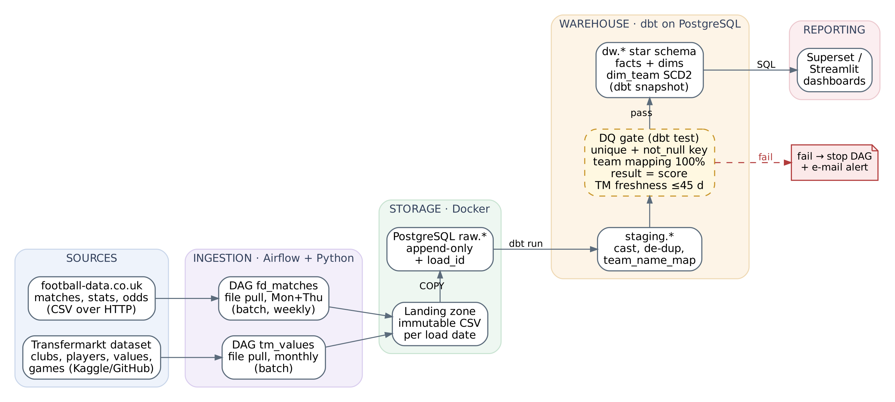
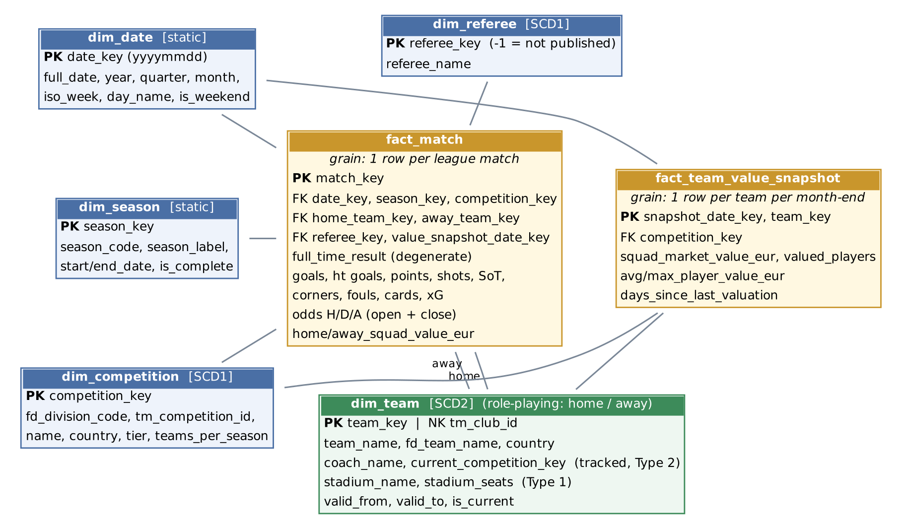

# European Football Results DW — Project 1 (LTAT.02.007, Group 14)

Author: Ron-Aran Paju

Data architecture and dimensional model (star schema) that combines **match results, statistics and bookmaker odds** with **club market values** for Europe's top-5 football leagues (Premier League, LaLiga, Serie A, Bundesliga, Ligue 1), seasons 2023/24 – 2026/27.

The main submission is **`P1_Group_14.pdf`** (3 pages). This repository holds the supporting SQL and diagrams. Physical implementation follows in Project 2.

## Business questions

1. Which teams over- or under-perform relative to their squad market value?
2. How often does the bookmaker favourite win, and which league is the least predictable?
3. How large is home advantage per league, and is it changing?
4. Which teams convert chances best (goals per shot on target)?
5. Do referees differ in cards and fouls per match?
6. Did a team's results change after a coach change? (SCD2)
7. Which were the biggest upsets?

## Data sources

| Source | Content | Access | Update |
|---|---|---|---|
| [football-data.co.uk](https://www.football-data.co.uk/data.php) | One row per match: scores, shots, corners, fouls, cards, referee (England), xG (2026/27+), odds | CSV per league/season: `mmz4281/<season>/<div>.csv` | ~twice a week in season |
| [Transfermarkt datasets](https://github.com/dcaribou/transfermarkt-datasets) ([Kaggle](https://www.kaggle.com/datasets/davidcariboo/player-scores)) | clubs, players, player_valuations, games (manager per match) | CSV files | weekly — **paused since July 2026** |

The sources have no shared key: team names are mapped through `staging.team_name_map`.

## Architecture



Airflow pulls files → landing zone → PostgreSQL `raw` → dbt `staging` → data-quality gate (dbt tests) → `dw` star schema → Superset / Streamlit.

## Star schema



| Table | Type | Grain / SCD |
|---|---|---|
| `fact_match` | transaction fact | one row per league match |
| `fact_team_value_snapshot` | periodic snapshot | one row per team per month-end |
| `dim_team` | dimension | SCD2 (coach, league), Type 1 stadium; role-playing home/away |
| `dim_competition`, `dim_referee` | dimension | SCD1 |
| `dim_date`, `dim_season` | dimension | static |

Full column list: [`docs/data_dictionary.md`](docs/data_dictionary.md).

## Repository layout

```
P1_Group_14.pdf                 main submission (3 pages)
sql/01_ddl.sql                  schemas raw / staging / dw, all tables and constraints
sql/02_sample_dml.sql           illustrative sample data (generated, NOT real results)
sql/03_demo_queries.sql         one query per business question
sql/04_data_quality_checks.sql  DQ checks (become dbt tests in Project 2)
docs/data_dictionary.md         every table and column with type and description
diagrams/*.dot, *.png           architecture and star-schema diagrams (Graphviz)
build_report.py                 regenerates the PDF
```

## Run it

```bash
docker run -d --name fdw -e POSTGRES_PASSWORD=pw -p 5432:5432 postgres:16
for f in sql/01_ddl.sql sql/02_sample_dml.sql sql/03_demo_queries.sql sql/04_data_quality_checks.sql; do
  psql "postgresql://postgres:pw@localhost:5432/postgres" -v ON_ERROR_STOP=1 -f "$f"
done
```

Tested on PostgreSQL 16. The completeness check (DQ5) reports gaps on the sample data by design — it only contains a few teams.

## LLM disclosure

Claude (Anthropic) was used to brainstorm the topic, check data source availability and draft the schema, SQL, diagrams and report; all output was reviewed by the author. Chat link is in `P1_Group_14.pdf`.
